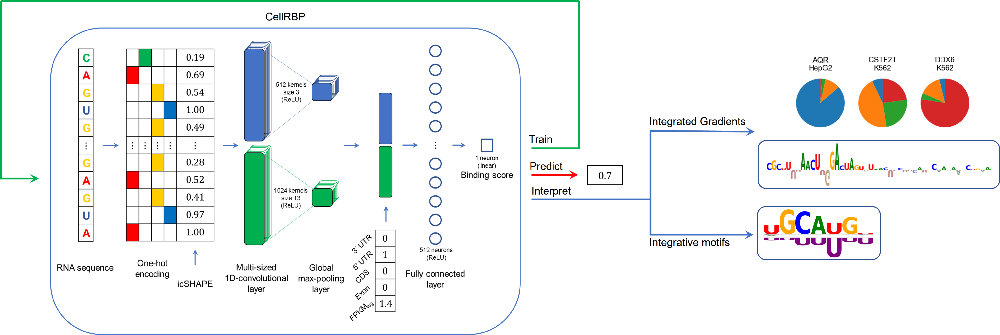

# CellRBP

## CellRBP Framework

CellRBP is based on a CNN that uniquely receives as input cell-type-specific information, such as experimentally measured RNA structure and RNA abundance, which enable the accurate
generalization across cell types. The model is then capable of predicting new binding sites on provided RNA sequences, as well as interpreting and visualizing various RNA-binding preferences.


	
## Requirements

- Python 3.9.15
- pip (requirements file)

## Installation

Install packages and clone repository :

```bash
pip install -r requirements.txt

cd CellRBP
git clone https://github.com/OrensteinLab/CellRBP.git
gunzip ./Features/df_transcripts.pkl.gz
gunzip ./Features/GTF/Homo_sapiens.GRCh38.89.gtf.gz
```

## Preprocess eCLIP data 

Add RNA abundance, RNA region types and predict missing icSHAPE values
(in this example: preprocess 2 eCLIP datasets - AGGF1-HepG2, AGGF1-K562)
```
python Scripts/Process_Data.py --process_eclip True --input_data_path Data/clip_data/AGGF1_HepG2.tsv
python Scripts/Process_Data.py --process_eclip True --input_data_path Data/clip_data/AGGF1_K562.tsv
```

## Training, prediction and and evaluation

### Cross-validation
Train a protein and cell type specific model based on processed eCLIP data (in this example: AGGF1-HepG2)
```
python Scripts/Model_Functions.py --TRAIN True --input_data_dir Data/clip_data_processed/AGGF1_HepG2/
```

Predict binding scores for the eCLIP test set 
```
python Scripts/Model_Functions.py --PREDICT True --predict_data_path Data/clip_data_processed/AGGF1_HepG2/Test_15.tsv --predict_model_dir Models/CellRBP/AGGF1/HepG2/
```

Evaluate the model performance given an annotated eCLIP test set
```
python Scripts/Model_Functions.py --EVALUATE True --predict_data_path Data/clip_data_processed/AGGF1_HepG2/Test_15.tsv --predict_model_dir Models/CellRBP/AGGF1/HepG2/
```

### Across cell types
Predict binding scores of a selected protein, given a model trained on the same protein but of a different cell type 
(in this example: use a model trained on AGGF1-HepG2 to predict binding scores of samples in AGGF1-K562)

```
python Scripts/Model_Functions.py --PREDICT True --predict_data_path Data/clip_data_processed/AGGF1_K562/Test_15.tsv --predict_model_dir Models/CellRBP/AGGF1/HepG2/
```

Evaluate the model performance across cell types 
(in this example: use a model trained on AGGF1-HepG2 to evaluate its prediction performance on samples in AGGF1-K562)

```
python Scripts/Model_Functions.py --EVALUATE True --predict_data_path Data/clip_data_processed/AGGF1_K562/Test_15.tsv --predict_model_dir Models/CellRBP/AGGF1/HepG2/
```

## Interpretation

### Local sequence and structure interpretation 
Retrieve sequence and structure local attribution scores for given samples
(in this example: get local interpretation for AGGF1-HepG2)
```
python Scripts/Interpretation_Functions.py --LOCAL_INTERPRETATION true --input_data_path Data\clip_data_processed\AGGF1_HepG2\all.tsv --model_data_dir Models\CellRBP\AGGF1\HepG2\
```


